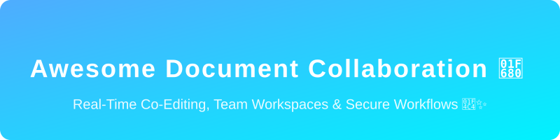

  

<h1 align="center">Awesome Document Collaboration 🚀📄</h1>

  
  
  &nbsp;&nbsp;&nbsp;&nbsp;&nbsp;&nbsp;&nbsp;&nbsp;&nbsp;&nbsp;
  

  <b>A Curated List of SaaS Products &amp; Open-Source GitHub Projects for Seamless Team Collaboration</b>  
  <i>Focused on Real-Time Co-Editing, File Sharing, Team Workspaces, Versioning &amp; Secure Document Workflows.</i>

  <strong>Last updated: August 2026</strong>

---

Welcome to the ultimate resource for **Document Collaboration** tools! 🌟 This repository tracks notable SaaS platforms and open-source projects that enable teams to create, edit, share, and manage documents, spreadsheets, presentations, and knowledge bases in real time. Perfect for optimizing workflows, enforcing data sovereignty, and enhancing productivity. 📈

### 📑 Table of Contents

- [💼 SaaS/Hosted Platforms](#-saashosted-platforms)
- [🔓 Open-Source GitHub Projects](#-open-source-github-projects)
- [🤝 How to Contribute](#-how-to-contribute)
- [⚠️ Disclaimer](#-disclaimer)

---

## 💼 SaaS/Hosted Platforms

Here is a curated list of enterprise and consumer document collaboration platforms, sorted by their company size (market cap or valuation/revenue) in descending order. 🏢

| Product | Description | Pricing | Free Tier Limit | Company Size |
|---------|-------------|---------|-----------------|--------------|
| **[Microsoft 365](https://www.microsoft.com/en-us/microsoft-365)** | Enterprise productivity platform with Word, Excel, PowerPoint, OneDrive, and SharePoint providing high-fidelity desktop + web co-authoring. | Starts at $6/user/mo | 5GB storage (Personal) | ~$3 Trillion Market Cap |
| **[Google Workspace](https://workspace.google.com/)** | Cloud-native suite (Docs, Sheets, Slides, Drive) offering seamless real-time co-editing, version history, and deep integration. | Starts at $6/user/mo | 15GB storage (Personal) | ~$2 Trillion Market Cap |
| **[Confluence](https://www.atlassian.com/software/confluence)** | Team knowledge base and documentation platform tightly integrated with Jira, supporting structured pages. | Starts at $6.05/user/mo | 10 users, 2GB storage | ~$50 Billion Market Cap |
| **[Notion](https://www.notion.so/)** | Flexible all-in-one workspace combining documents, databases, wikis, and project tools with real-time collaboration. | Starts at $8/user/mo | Unlimited blocks (Indiv.), 5MB files | ~$10 Billion Valuation |
| **[Dropbox DocSend](https://www.dropbox.com/docsend)** | Secure document sharing and tracking solution focused on controlled external collaboration and analytics. | Starts at $15/user/mo | None (14-day trial) | ~$8 Billion Market Cap |
| **[Box](https://www.box.com/)** | Enterprise content cloud for secure file sharing, collaboration, governance, and workflow automation. | Starts at $15/user/mo | 10GB storage, 250MB uploads | ~$6 Billion Market Cap |
| **[Egnyte](https://www.egnyte.com/)** | Hybrid content collaboration and governance platform combining cloud and on-premises storage. | Starts at $20/user/mo | None (15-day trial) | ~$1 Billion Valuation |
| **[Zoho WorkDrive](https://www.zoho.com/workdrive/)** | Team file management and collaboration platform with online editors, granular permissions, and workflows. | Starts at $2.50/user/mo | None (15-day trial) | Private (~$1B Revenue) |
| **[Nextcloud](https://nextcloud.com/)** | Content collaboration platform offering file sync, sharing, collaborative editing, and groupware features. | Free (Self-hosted) / Varies | Varies by hosting provider | Private (~€30M Revenue) |
| **[ONLYOFFICE](https://www.onlyoffice.com/)** | Online office suite with strong Microsoft Office format compatibility, real-time co-editing, cloud and self-hosted options. | Starts at $15/admin/mo | 2GB storage, 2 users | Private (<$20M Revenue) |

---

## 🔓 Open-Source GitHub Projects

Explore these amazing open-source alternatives, sorted by their GitHub stars (descending order). Perfect for organizations seeking data sovereignty, privacy, and full control. 🛡️

- **[AppFlowy](https://github.com/AppFlowy-IO/AppFlowy)**   
  Open-source Notion alternative for documents, databases, and team knowledge management with offline-first capabilities.

- **[NocoDB](https://github.com/nocodb/nocodb)**   
  Open-source Airtable alternative that turns any database into a smart collaborative spreadsheet.

- **[AFFiNE](https://github.com/toeverything/AFFiNE)**   
  Open-source collaborative workspace combining docs, whiteboards, and databases with a focus on privacy and local-first design.

- **[Logseq](https://github.com/logseq/logseq)**   
  A local-first, non-linear, outliner notebook for organizing and sharing personal knowledge bases.

- **[Outline](https://github.com/outline/outline)**   
  Modern open-source knowledge base and team wiki with real-time collaborative editing and clean documentation workflows.

- **[Trilium Notes](https://github.com/zadam/trilium)**   
  Hierarchical note-taking application with focus on building large personal knowledge bases.

- **[Nextcloud Server](https://github.com/nextcloud/server)**   
  Leading open-source content collaboration platform for file sync & share, real-time office editing, and full data control.

- **[Wiki.js](https://github.com/requarks/wiki)**   
  A modern, lightweight, and powerful wiki app built on Node.js.

- **[Seafile](https://github.com/haiwen/seafile)**   
  High-performance open-source file sync and share platform with strong collaboration features and optional online editing integrations.

- **[Etherpad](https://github.com/ether/etherpad-lite)**   
  Lightweight, highly customizable real-time collaborative text editor ideal for meeting notes and shared documents.

- **[ownCloud](https://github.com/owncloud/core)**   
  Open-source file sync, share, and collaboration platform focused on data ownership and extensibility.

- **[DocuSeal](https://github.com/docusealco/docuseal)**   
  Open-source document signing and sharing platform, a self-hosted alternative to DocuSign.

- **[ONLYOFFICE Document Server](https://github.com/ONLYOFFICE/DocumentServer)**   
  Open-source online office suite providing collaborative editing with excellent Microsoft Office format fidelity.

- **[CryptPad](https://github.com/cryptpad/cryptpad)**   
  End-to-end encrypted, zero-knowledge collaboration suite offering real-time documents, spreadsheets, and pads.

- **[HedgeDoc](https://github.com/hedgedoc/hedgedoc)**   
  Open-source real-time collaborative Markdown editor for creating, sharing, and co-editing notes and documentation.

- **[Collabora Online](https://github.com/CollaboraOnline/online)**   
  LibreOffice-based open-source collaborative online office suite for real-time editing of ODF and Office formats.

- **[Tracim](https://github.com/tracim/tracim)**   
  Open-source collaboration suite combining file sharing, threaded discussions, collaborative pages, tasks, and workspace organization.

---

## 🤝 How to Contribute

1. Fork the repo. 🍴
2. Add/edit entries in `README.md` (follow the existing format and sort orders).
3. Include: name, link, 1–2 sentence description, and whether it's SaaS or open-source.
4. Submit PR with a short explanation. ✅

Star the repo if you find it useful! ⭐

---

## ⚠️ Disclaimer

- This is a **community-curated** list — not exhaustive and not an endorsement.
- Document collaboration platforms must comply with data protection regulations (GDPR, etc.) and organizational security policies, especially when handling sensitive or regulated content.
- Self-hosted open-source solutions require proper security hardening, backup strategies, and operational reliability. 🔒

---

## 📈 Star History

<a href="https://www.star-history.com/?repos=ishandutta2007%2FAwesome-Document-Collaboration&type=date&legend=bottom-right">
<picture>
<source media="(prefers-color-scheme: dark)" srcset="https://api.star-history.com/chart?repos=ishandutta2007/Awesome-Document-Collaboration&type=date&theme=dark&legend=bottom-right" />
<source media="(prefers-color-scheme: light)" srcset="https://api.star-history.com/chart?repos=ishandutta2007/Awesome-Document-Collaboration&type=date&legend=bottom-right" />

</picture>
</a>

---

  <b>Made for teams, knowledge workers, IT administrators, and privacy-conscious organizations.</b> 
  Let's make document collaboration more open, secure, and under user control. 🌍✌️

